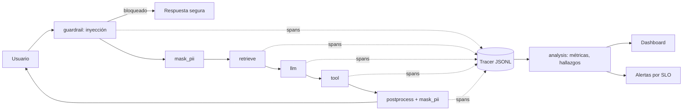

# Boceto de arquitectura

```mermaid
flowchart LR
  U[Usuario] --> G[guardrail: inyección]
  G -- bloqueado --> R0[Respuesta segura]
  G --> M[mask_pii]
  M --> RT[retrieve]
  RT --> L[llm]
  L --> T[tool]
  T --> PP[postprocess + mask_pii]
  PP --> U
  G & RT & L & T & PP -. spans .-> TR[(Tracer JSONL)]
  TR --> A[analysis: métricas, hallazgos] --> D[Dashboard]
  A --> AL[Alertas por SLO]
```
